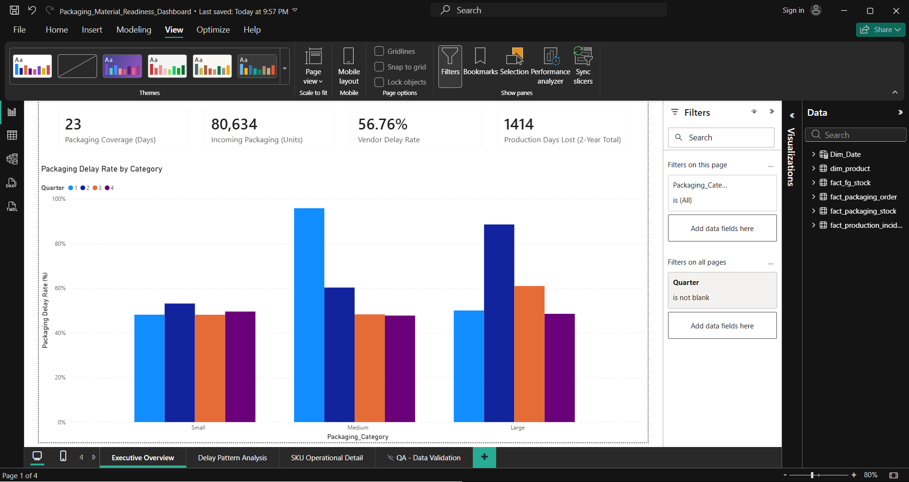
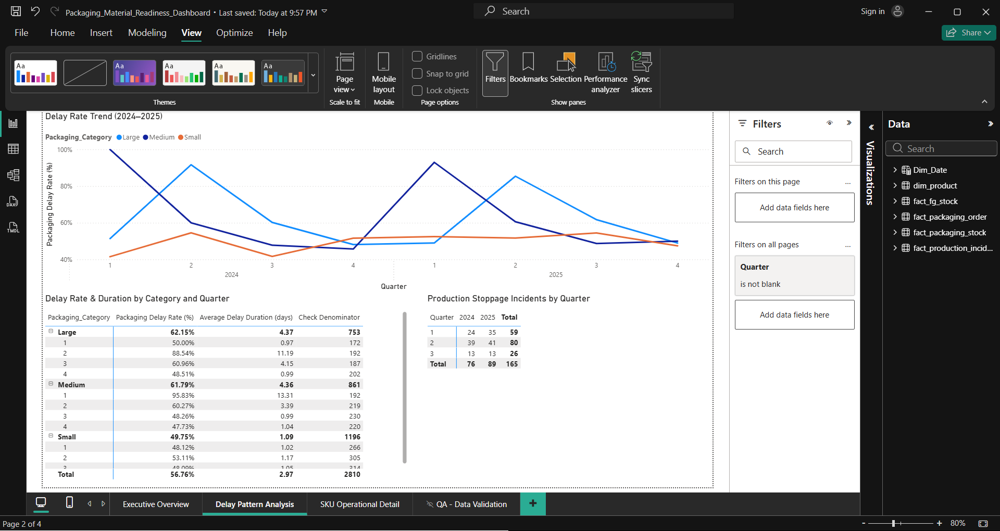

# Packaging Material Readiness — PPIC Business Intelligence Project

A Power BI project analyzing packaging material delivery delays and their impact on production planning, built from the perspective of a PPIC (Production Planning & Inventory Control) analyst in a manufacturing company.

---

## 1. Business Understanding

Every week, the PPIC team manually cross-checks two things before finalizing the production plan:
- Packaging material ETA from vendors (tracked in a shared spreadsheet, updated by Purchasing)
- Finished goods stock coverage on the consumer/distribution side

This process is reactive and done case-by-case, with no visibility into historical delay patterns by packaging category — so recurring risks (e.g. a particular packaging size being consistently late in a specific quarter) are not identified early.

**Stakeholders affected when production misses target:** Owner, PPIC, Fulfillment, Marketing.
**Business impact:** shipment delays, stockout risk, unfulfilled marketing promotions.

**Scope decisions:**
- Focused on **packaging material readiness** only. Raw material delays were excluded — they were reported as "coincidental" with no discernible pattern, making them unsuitable for reliable analysis with the available data.
- Demand volatility / bullwhip effect was also excluded — it requires multi-tier supply chain order data that isn't available in this dataset. It's noted as a downstream risk outside this project's scope.

## 2. Problem Statement

Every week, the PPIC team manually cross-references packaging vendor ETAs against finished-goods stock coverage to assess production disruption risk. This process is reactive and lacks visibility into historical delay patterns by packaging category/size — so recurring seasonal risks are not identified early enough to mitigate. This can result in unplanned production stoppages (historically 1–4 weeks per incident), contributing to shipment delays, stockout risk, and unfulfilled marketing promotions.

## 3. KPIs

| KPI | Purpose |
|---|---|
| Packaging Stock on Hand | Current packaging inventory level |
| Days of Packaging Coverage | How many days current stock will last at current usage rate |
| Packaging Stock (Box Equivalent) | Cross-functional communication metric (PPIC/Fulfillment/Marketing) |
| Finished Goods Stock Coverage (Days) | Second variable in the risk equation — determines whether a packaging delay actually matters |
| Incoming Packaging Quantity (On Order) | Point-in-time operational metric, intentionally filter-independent |
| Packaging Delay Rate (%) | Core KPI — how often packaging arrives late vs. promised ETA |
| Average Delay Duration (days) | How severe the delays are, not just how frequent |
| Delay Rate by Category/Size | Reveals the seasonal pattern by packaging category |
| Production Days Lost | Business impact measure — actual production stoppage duration |

## 4. Data

Synthetic dataset (100 SKUs, 24-month period, weekly snapshot cadence matching the real Wednesday planning cycle), designed to reflect realistic PPIC business logic. Star schema with `Dim_Product`, `Dim_Date`, and 4 fact tables (`Fact_PackagingOrder`, `Fact_PackagingStock`, `Fact_FGStock`, `Fact_ProductionIncident`), each with a distinct grain.

The raw data was intentionally seeded with realistic data quality issues (duplicate records, mixed date formats, whitespace, negative values, missing ETAs) to practice and demonstrate a full Data Cleaning workflow in Power Query — including handling ambiguous date formats, locale-sensitive number parsing, and semantic (not just literal) duplicate detection.

## 5. Data Model

Star schema, `Dim_Product` merged with packaging attributes (1:1 relationship — avoided unnecessary snowflaking). `Fact_PackagingOrder` has 3 date columns (role-playing dimension against `Dim_Date`) — `Promised_ETA_Date` is the active relationship since the core insight is measured from when packaging was expected, not when it was ordered or actually arrived.

## 6. Key Insights

1. **Medium packaging** delay rate spikes to ~96–100% in **Q1**, consistent across both 2024 and 2025 (vs. ~48–67% in other quarters).
2. **Large packaging** delay rate spikes to ~85–92% in **Q2**, also consistent across both years.
3. **Small packaging** stays low-risk — delay rate never exceeded 55% in any quarter across the 2-year period.
4. Production stoppage incidents were highest in **Q1 (59 incidents)** and **Q2 (80 incidents)** — coinciding with the Medium/Large delay spikes, suggesting the delay pattern translates into real production impact rather than being a statistical anomaly.

## 7. Recommendations

1. **Immediate:** Build Medium packaging coverage to ~37 days by end of Q4 (category-specific baseline of 24 days + the average 13.3-day delay historically observed in Q1).
2. **Immediate:** Build Large packaging coverage to ~30 days by end of Q1 (category-specific baseline of 19 days + the average 11.2-day delay historically observed in Q2).
3. **Small packaging:** maintain current monitoring cadence — no additional safety stock investment needed; prioritize resources toward Medium and Large.
4. **Strategic (long-term):** evaluate and vet backup suppliers for Medium and Large packaging as contingency fulfillment during critical quarters (Q1 and Q2).

## 8. Dashboard Structure

3 pages, following an inverted-pyramid structure (general → specific):
- **Executive Overview** — 4 headline KPI cards + delay rate by category/quarter chart. No date slicer by design, so all cards consistently reflect current-state metrics.
- **Delay Pattern Analysis** — trend chart with drillable Year → Quarter → Month hierarchy, plus a detail matrix with sample-size transparency.
- **SKU Operational Detail** — per-SKU operational table with conditional formatting, built for the weekly (Wednesday) PPIC review process.

## 9. Tools

Power BI (Power Query, DAX), Python (synthetic data generation).

---

## Notes on Data Quality & Methodology

This is a portfolio project using synthetic data designed to mirror a real PPIC business process. A few methodology notes, kept here for transparency:

- 8 records with negative `Qty_Ordered` (~0.3% of orders) were excluded rather than corrected, since source verification wasn't available and correcting them would mean fabricating values.
- Rows with missing `Actual_Arrival_Date` or `Promised_ETA_Date` were deliberately left blank rather than imputed — they reflect genuine "not yet arrived" or "vendor didn't fill it in" states.
- The synthetic data generator's restock logic was corrected mid-project after an initial version caused unrealistic, ever-increasing stock levels; the corrected version uses an order-up-to inventory policy based on each category's lead time.
